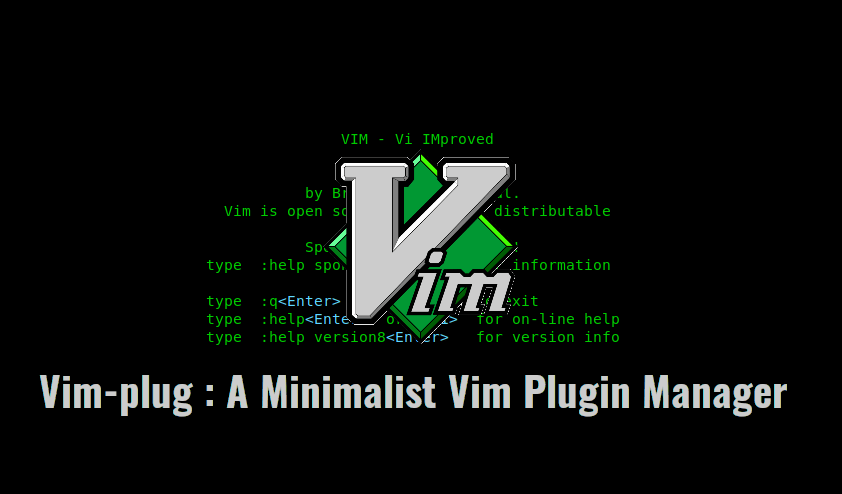

I use [vim-plug](https://github.com/junegunn/vim-plug) to mange Vim plugins because it's easy to set up.

You can check out my vim configs on [.vimrc](https://github.com/locphan87/dotfiles/blob/master/.vimrc) and my installed plugins on [this doc](https://github.com/locphan87/dotfiles/blob/master/docs/vim-plugins.md).