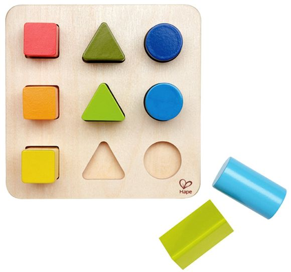

## What is pattern matching?
[Pattern matching](https://en.wikipedia.org/wiki/Pattern_matching) is a common technique in [functional programming](https://en.wikipedia.org/wiki/Functional_programming) languages. It allows us to decompose data structures in a concise syntax.

Generating [Fibonacci numbers](https://en.wikipedia.org/wiki/Fibonacci_number) in [Haskell](https://www.haskell.org/)
```haskell:title=
fib 0 = 1
fib 1 = 1
fib n | n >= 2 
	= fib (n-1) + fib (n-2)
```

## Pattern matching in JavaScript
Pattern matching is not supported officially yet in JavaScript. There is a [proposal](https://github.com/tc39/proposal-pattern-matching) for this feature. 

Example: A contrived parser for a text-based adventure game
```javascript
match (command) {
  when ([ 'go', ('north' | 'east' | 'south' | 'west') as dir ]) { … }
  when ([ 'take', item ]) { … }
  else { … }
}
```

At the time of writing, it's at stage 1. While waiting for the official support, I'd like to introduce a simple tool for writing pattern matching style in JavaScript.

## Meet match-values
[match-values](https://github.com/locphan87/match-values) allow us to do a simple pattern matching based on JavaScript literals. It helps to write conditional logic in a convenient way. The library is small and there is no dependencies.

Let's check out a few examples below

Match a pattern to get a font size
```javascript
import match from 'match-values'

const pattern = {
  h1: 20,
  h2: 18,
  title: 16,
  description: 14,
  _: 13
}
match('h1', pattern) // 20
match('h2', pattern) // 18
match('title', pattern) // 16
match('description', pattern) // 14
match('anything', pattern) // 13
```

Match a pattern to get a function
```javascript
import match from 'match-values'

const handleError = match(error, {
  NOT_FOUND: () => showErrorMessage('Page not found'),
  TIMEOUT: () => showErrorMessage('Page has timed out'),
  _: NOOP
})
handleError()
```

Match conditions to get a value
```javascript
import { match, _ } from 'match-values'

const pattern = {
  [x => x > 5, 'smaller'],
  [x => x === 5, 'correct'],
  [_, 'greater']
}
match(8, pattern) // smaller
match(5, pattern) // correct
match(1, pattern) // greater
```

Read more
- [What's wrong with the switch statement](https://medium.com/tandemly/whats-wrong-with-the-switch-statement-in-javascript-c560e8ea3c0b)
- [Bringing Pattern Matching to TypeScript](https://dev.to/gvergnaud/bringing-pattern-matching-to-typescript-introducing-ts-pattern-v3-0-o1k)